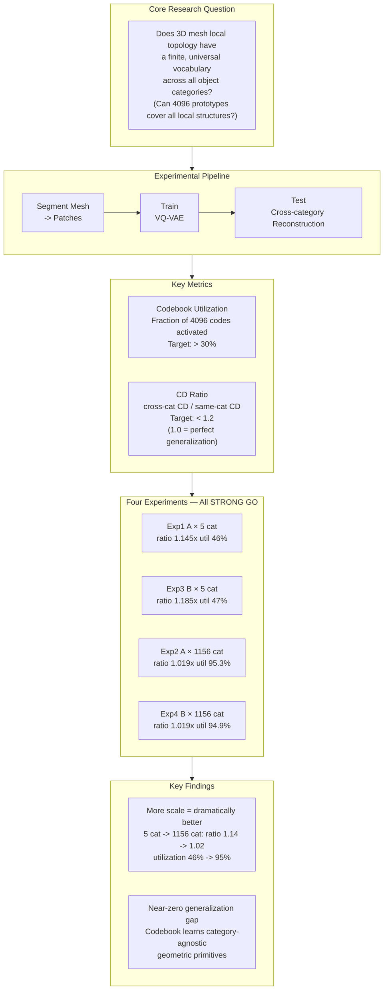
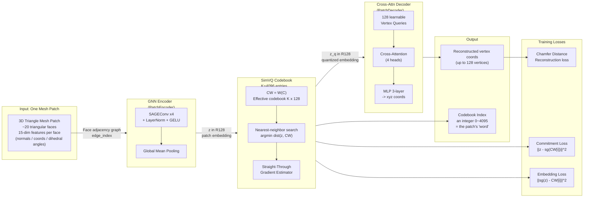
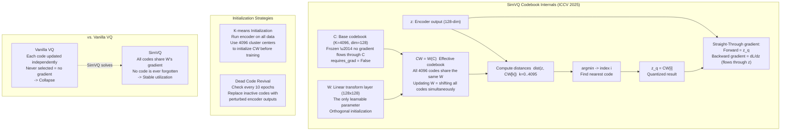

# MeshLex Research

<div align="center">

**MeshLex: Learning a Topology-aware Patch Vocabulary for Compositional Mesh Generation**

<a href="https://huggingface.co/Pthahnix/MeshLex-Research"></a>
<a href="https://github.com/Pthahnix/MeshLex-Research/blob/main/LICENSE"></a>

</div>

<hr>

## Table of Contents

1. [Motivation](#motivation)
2. [Core Hypothesis](#core-hypothesis)
3. [Current Status](#current-status)
4. [Timeline](#timeline)
5. [Pipeline](#pipeline)
6. [Repository Structure](#repository-structure)
7. [Key Differentiators](#key-differentiators)
8. [Quick Start](#quick-start)
9. [Technical Deep Dive](#technical-deep-dive)
    - [Research Question](#research-question)
    - [Model Architecture](#model-architecture)
    - [SimVQ: Why Codebook Collapse Doesn't Happen](#simvq-why-codebook-collapse-doesnt-happen)
    - [Evaluation Metrics](#evaluation-metrics)
    - [Experimental Results and Scaling Finding](#experimental-results-and-scaling-finding)
10. [License](#license)

A research project exploring whether 3D triangle meshes possess a finite, reusable "vocabulary" of local topological patterns — analogous to how BPE tokens form a vocabulary for natural language.

## Motivation

All current mesh generation methods serialize meshes into 1D token sequences and feed them to transformers. They differ only in *how* they serialize (BPT, EdgeBreaker, FACE, etc.) and *what* backbone they use (GPT, DiT, Mamba, etc.). But mesh is fundamentally a graph — forcing it into a sequence is like cutting a map into strips and asking a model to reassemble it.

MeshLex takes a different approach: instead of generating meshes face-by-face, we learn a **codebook of ~4096 topology-aware patches** (each covering 20-50 faces) and generate meshes by selecting, deforming, and assembling patches from this codebook. A 4000-face mesh becomes ~130 tokens — an order of magnitude more compact than the state-of-the-art (FACE, ICML 2026: ~400 tokens).

## Core Hypothesis

> Mesh local topology is low-entropy and universal across object categories. A finite codebook of ~4096 topology prototypes, combined with continuous deformation parameters, can reconstruct arbitrary meshes with high fidelity.

## Current Status

**Phase: Feasibility validation COMPLETE — 4/4 experiments STRONG GO. Ready for formal experiment design.**

| # | Experiment | Status | Result |
|---|-----------|--------|--------|
| 1 | A-stage × 5-Category | **Done** | STRONG GO (ratio 1.145x, util 46%) |
| 2 | A-stage × LVIS-Wide | **Done** | **STRONG GO (ratio 1.019x, util 95.3%)** |
| 3 | B-stage × 5-Category | **Done** | STRONG GO (ratio 1.185x, util 47%) |
| 4 | B-stage × LVIS-Wide | **Done** | **STRONG GO (ratio 1.019x, util 94.9%)** |

Key findings:
- SimVQ collapse fix successful: utilization 0.46% → 99%+ (217x improvement)
- B-stage multi-token KV decoder effective: reconstruction CD reduced 6.2%
- Rotation trick incompatible with SimVQ (causes rapid collapse)
- Cross-category generalization validated: CD ratio 1.019-1.185x (all < 1.2 threshold)
- **More categories = dramatically better generalization**: LVIS-Wide (1156 cat) ratio 1.019x vs 5-cat 1.145x, util 95% vs 46%
- **Best result (Exp4)**: Same-cat CD 211.6, Cross-cat CD 215.8 — near-zero generalization gap

## Timeline

- **Day 1 (2026-03-06)**: Project inception, gap analysis, idea generation, experiment design
- **Day 2 (2026-03-07)**: Full codebase implementation (14 tasks), unit tests, initial experiment
- **Day 3 (2026-03-08)**: Diagnosed codebook collapse, fixed SimVQ implementation, Exp1 v2 (A-stage 5cat) training + eval completed — **STRONG GO**. B-stage code implemented (rotation trick + multi-token KV decoder)
- **Day 4 (2026-03-09)**: Exp3 (B-stage 5cat) completed — **STRONG GO** (CD -6.2%). Discovered rotation trick incompatible with SimVQ. LVIS-Wide data prepared (844 categories, 71K patches). Exp2 (A-stage LVIS-Wide) completed — **STRONG GO** (ratio 1.07x, util 67.8%). Key finding: more categories = better generalization
- **Day 5 (2026-03-13)**: Pod reset recovery — retrained Exp1/Exp3 from HF checkpoints, expanded LVIS-Wide dataset (1156 categories, 246K patches). Retrained Exp2 (A-stage LVIS-Wide) — **STRONG GO** (ratio 1.019x, util 95.3%). Trained Exp4 (B-stage LVIS-Wide) — **STRONG GO** (ratio 1.019x, util 94.9%). All 4 experiments completed
- **Day 6 (2026-03-14)**: Final comparison report + visualizations generated. Full dataset + checkpoints backed up to HuggingFace. Documentation updated

## Pipeline

```
Objaverse-LVIS GLB → Decimation (pyfqmr) → Normalize [-1,1]
    → METIS Patch Segmentation (~35 faces/patch)
    → PCA-aligned local coordinates
    → Face features (15-dim: vertices + normal + angles)
    → SAGEConv GNN Encoder → 128-dim embedding
    → SimVQ Codebook (K=4096, learnable reparameterization)
    → Cross-attention MLP Decoder → Reconstructed vertices
```

## Repository Structure

```
src/                               # Core modules
├── data_prep.py                   # Mesh loading, decimation, normalization
├── patch_segment.py               # METIS patch segmentation + PCA normalization
├── patch_dataset.py               # NPZ serialization + PyTorch/PyG Dataset
├── model.py                       # PatchEncoder, SimVQCodebook, PatchDecoder, MeshLexVQVAE
├── losses.py                      # Masked Chamfer Distance loss
├── trainer.py                     # Training loop (encoder warmup + K-means init + dead code revival)
└── evaluate.py                    # Evaluation metrics + Go/No-Go decision

scripts/                           # CLI entry points
├── download_objaverse.py          # Download from Objaverse-LVIS (5cat / lvis_wide modes)
├── download_shapenet.py           # [legacy] Download ShapeNet from HuggingFace
├── run_preprocessing.py           # Batch preprocess (supports manifest JSON + ShapeNet dirs)
├── train.py                       # Training (supports --resume)
├── init_codebook.py               # K-means codebook initialization
├── evaluate.py                    # Same-cat / cross-cat evaluation
├── visualize.py                   # t-SNE, utilization histogram, training curves
├── final_comparison.py            # Cross-experiment comparison visualizations
└── validate_task*.py              # Per-task real data validation scripts

tests/                             # 17 unit tests
├── test_data_prep.py              # 2 tests
├── test_patch_segment.py          # 4 tests
├── test_patch_dataset.py          # 3 tests
└── test_model.py                  # 8 tests

results/                           # Validation outputs (committed)
├── task1_3_validation/            # Data prep + patch segmentation
├── task4_validation/              # Dataset serialization
├── task5_7_validation/            # Encoder/Codebook/Decoder
├── task8_10_validation/           # VQ-VAE + Training
├── task12_validation/             # Visualization
├── task13_validation/             # K-means init
├── exp1_v2_collapse_fix/          # Exp1 v2 training reports + model analysis
├── exp1_A_5cat/                   # Exp1 A-stage 5cat eval + report
├── exp2_A_lvis_wide/              # Exp2 A-stage LVIS-Wide eval + report
├── exp3_B_5cat/                   # Exp3 B-stage 5cat eval + report
├── exp4_B_lvis_wide/              # Exp4 B-stage LVIS-Wide eval + report
└── final_comparison/              # Final 4-experiment comparison dashboard + report

.context/                          # Research documents (chronological)
├── 00-09_*.md                     # Research evolution documents
├── material/                      # Analysis summaries of key papers
└── paper/                         # [gitignored] 300+ paper markdown files
```

## Key Differentiators

| | MeshMosaic | FreeMesh | FACE | **MeshLex** |
|---|---|---|---|---|
| Approach | Divide-and-conquer | BPE on coordinates | One-face-one-token | **Topology patch codebook** |
| Still per-face generation? | Yes (within each patch) | Yes (merged coordinates) | Yes | **No** |
| Has codebook? | No | Yes (coordinate-level) | No | **Yes (topology-level)** |
| Compression (4K faces) | N/A | ~300 tokens | ~400 tokens | **~130 tokens** |

## Quick Start

```bash
# Install dependencies
pip install -r requirements.txt
pip install torch-geometric
pip install pyg_lib torch_scatter torch_sparse torch_cluster torch_spline_conv \
    -f https://data.pyg.org/whl/torch-2.4.0+cu124.html

# Run unit tests
python -m pytest tests/ -v

# See RUN_GUIDE.md for full training pipeline
```

---

## Technical Deep Dive

### Research Question

MeshLex asks: does 3D mesh local topology behave like natural language — with a finite, universal "vocabulary" that transfers across all object categories?

Every 3D object is cut into small **patches** (local mesh fragments of ~20 triangles each). Intuitively, the corner of a table leg, the curve of a car door, the flat surface of a chair back — these local shapes repeat across different objects. MeshLex aims to distill these recurring structures into **4096 prototype entries (a codebook)**, then verify whether this vocabulary generalizes to object categories never seen during training.



### Model Architecture

The full model is a VQ-VAE with three modules in series:

- **Module 1 — PatchEncoder**: A GNN encoder that compresses one patch (a small graph) into a 128-dimensional continuous vector **z**
- **Module 2 — SimVQ Codebook**: Discrete quantization that maps z to the nearest "word" in the dictionary, outputting an integer **index** (0–4095) and a quantized vector **z\_q**
- **Module 3 — PatchDecoder**: A cross-attention decoder that reconstructs per-vertex xyz coordinates from z\_q



### SimVQ: Why Codebook Collapse Doesn't Happen

This is the most critical technical contribution of the work.

**The problem with vanilla VQ-VAE (Codebook Collapse)**: In standard VQ, each code only receives a gradient update when it is selected as the nearest neighbor. Codes that are never selected in the cold-start phase receive no gradient, never update, and eventually die. Only a handful of codes survive — this is codebook collapse.

**SimVQ's solution — Frozen C + Learnable W**: The codebook is split into a frozen base matrix **C** and a learnable linear transform **W**. The effective codebook is **CW = W(C)**. Since all 4096 entries share the same W, any update to W simultaneously shifts *every* entry in CW — even codes that were never selected still move with each gradient step.

**Intuition**: Vanilla VQ is like 4096 independent actors where only those who perform get to practice. SimVQ gives all actors a shared training system (W) — even those waiting offstage keep improving.



### Evaluation Metrics

**Codebook Utilization**: The fraction of the 4096 codebook entries activated at least once on the evaluation set. Target: > 30%. Low utilization indicates codebook collapse — most "words" in the dictionary are wasted.

**CD Ratio (Cross-category Chamfer Distance Ratio)**:

$$\text{CD Ratio} = \frac{\text{Cross-category Chamfer Distance}}{\text{Same-category Chamfer Distance}}$$

- **Numerator**: reconstruction error on patches from **unseen** categories (categories held out during training)
- **Denominator**: reconstruction error on patches from **seen** categories
- The closer to 1.0, the better the vocabulary generalizes to unseen categories
- Target: < 1.2 (at most 20% worse than seen categories)

### Experimental Results and Scaling Finding

| Experiment | Scale | Stage | CD Ratio | Util (same) | Util (cross) | Decision |
|------------|-------|-------|----------|-------------|--------------|----------|
| Exp1 | 5 categories | A (single-token KV) | 1.145x | 46.0% | 47.0% | ✅ STRONG GO |
| Exp3 | 5 categories | B (4-token KV) | 1.185x | 47.1% | 47.3% | ✅ STRONG GO |
| Exp2 | 1156 categories | A (single-token KV) | **1.019x** | **95.3%** | **83.6%** | ✅ **STRONG GO** |
| **Exp4** | **1156 categories** | **B (4-token KV)** | **1.019x** | **94.9%** | **82.8%** | ✅ **STRONG GO** |

Scaling from 5 to 1156 categories causes CD ratio to **drop from 1.145x to 1.019x** (near-perfect generalization) and utilization to **surge from 46% to 95%** (nearly full codebook activation). The vocabulary becomes dramatically more universal with more diverse training data.

Exp4 (B-stage × LVIS-Wide) achieves the best absolute reconstruction quality (same-cat CD 211.6, cross-cat CD 215.8) with a generalization gap of only 1.9% — strong evidence that the learned 4096 patch prototypes are genuinely category-agnostic geometric primitives.

---

## License

Apache-2.0
