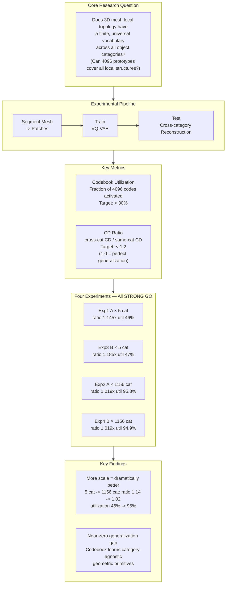
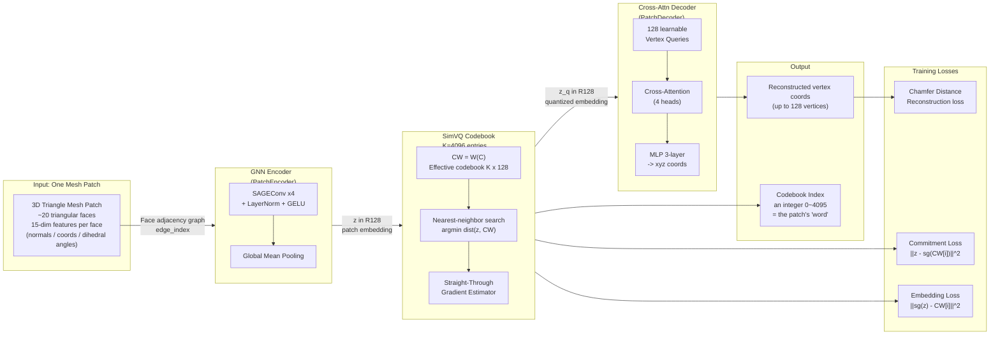
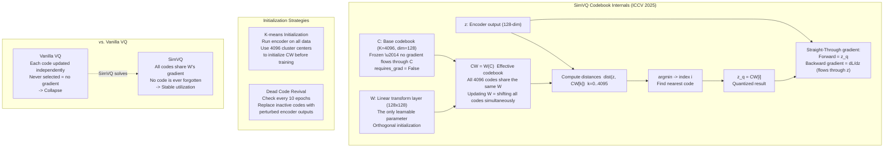

# MeshLex Research

<div align="center">

**MeshLex: Learning a Topology-aware Patch Vocabulary for Compositional Mesh Generation**

<a href="https://github.com/Pthahnix/MeshLex-Research"></a>
<a href="https://huggingface.co/Pthahnix/MeshLex-Research"></a>
<a href="https://github.com/Pthahnix/MeshLex-Research/blob/main/LICENSE"></a>

</div>

<hr>

## Table of Contents

1. [Motivation](#motivation)
2. [Core Hypothesis](#core-hypothesis)
3. [Current Status](#current-status)
4. [Timeline](#timeline)
5. [Pipeline](#pipeline)
6. [Repository Structure](#repository-structure)
7. [Key Differentiators](#key-differentiators)
8. [Quick Start](#quick-start)
9. [Technical Deep Dive](#technical-deep-dive)
    - [Research Question](#research-question)
    - [Model Architecture (v1 VQ-VAE)](#model-architecture)
    - [SimVQ: Why Codebook Collapse Doesn't Happen](#simvq-why-codebook-collapse-doesnt-happen)
    - [v2: RVQ + Autoregressive Generation](#v2-rvq--autoregressive-generation)
    - [Evaluation Metrics](#evaluation-metrics)
    - [Experimental Results and Scaling Finding](#experimental-results-and-scaling-finding)
10. [License](#license)

A research project exploring whether 3D triangle meshes possess a finite, reusable "vocabulary" of local topological patterns — analogous to how BPE tokens form a vocabulary for natural language.

## Motivation

All current mesh generation methods serialize meshes into 1D token sequences and feed them to transformers. They differ only in *how* they serialize (BPT, EdgeBreaker, FACE, etc.) and *what* backbone they use (GPT, DiT, Mamba, etc.). But mesh is fundamentally a graph — forcing it into a sequence is like cutting a map into strips and asking a model to reassemble it.

MeshLex takes a different approach: instead of generating meshes face-by-face, we learn a **codebook of ~4096 topology-aware patches** (each covering 20-50 faces) and generate meshes by selecting, deforming, and assembling patches from this codebook. A 4000-face mesh becomes ~130 tokens — an order of magnitude more compact than the state-of-the-art (FACE, ICML 2026: ~400 tokens).

## Core Hypothesis

> Mesh local topology is low-entropy and universal across object categories. A finite codebook of ~4096 topology prototypes, combined with continuous deformation parameters, can reconstruct arbitrary meshes with high fidelity.

## Current Status

**Phase: v2 Implementation IN PROGRESS — Full generation pipeline operational.**

### v1 Feasibility Validation — COMPLETE (4/4 STRONG GO)

| # | Experiment | Status | Result |
|---|-----------|--------|--------|
| 1 | A-stage × 5-Category | **Done** | STRONG GO (ratio 1.145x, util 46%) |
| 2 | A-stage × LVIS-Wide | **Done** | **STRONG GO (ratio 1.019x, util 95.3%)** |
| 3 | B-stage × 5-Category | **Done** | STRONG GO (ratio 1.185x, util 47%) |
| 4 | B-stage × LVIS-Wide | **Done** | **STRONG GO (ratio 1.019x, util 94.9%)** |

### v2 End-to-End Generation — IN PROGRESS

| Module | Component | Status | Key Result |
|--------|-----------|--------|------------|
| M1 | METIS Partitioning (baseline) | **Done** | 188K patches from 4674 meshes |
| M1 | Graph BPE (data-driven) | Feasibility GO, training pending | Merge quality needs improvement |
| M2 | RVQ Tokenizer (3-level) | **Done** | Loss 0.177, util 100%, 10^9 capacity |
| M3 | AR Generation (PatchGPT) | **Done** | Loss 1.48, ppl 4.4 (20.4M params) |
| M4 | Assembly + Surface Recon | **Done** | Ball Pivoting / Alpha Shapes |

Key findings (v2):
- RVQ 3-level quantization achieves 100% codebook utilization across all levels
- AR v1 (87.3M params) failed with loss plateau at 5.41 — too many params for 4674 training sequences
- AR v2 (20.4M params + gradient accumulation + LR warmup) achieved 51x perplexity improvement (224 → 4.4)
- Full pipeline operational: token generation → RVQ decode → surface reconstruction → OBJ export
- 4000-face mesh → ~130 patch tokens (7 tokens each) → reconstructed mesh

## Timeline

- **Day 1 (2026-03-06)**: Project inception, gap analysis, idea generation, experiment design
- **Day 2 (2026-03-07)**: Full codebase implementation (14 tasks), unit tests, initial experiment
- **Day 3 (2026-03-08)**: Diagnosed codebook collapse, fixed SimVQ implementation, Exp1 v2 (A-stage 5cat) training + eval completed — **STRONG GO**. B-stage code implemented (rotation trick + multi-token KV decoder)
- **Day 4 (2026-03-09)**: Exp3 (B-stage 5cat) completed — **STRONG GO** (CD -6.2%). Discovered rotation trick incompatible with SimVQ. LVIS-Wide data prepared (844 categories, 71K patches). Exp2 (A-stage LVIS-Wide) completed — **STRONG GO** (ratio 1.07x, util 67.8%). Key finding: more categories = better generalization
- **Day 5 (2026-03-13)**: Pod reset recovery — retrained Exp1/Exp3 from HF checkpoints, expanded LVIS-Wide dataset (1156 categories, 246K patches). Retrained Exp2 (A-stage LVIS-Wide) — **STRONG GO** (ratio 1.019x, util 95.3%). Trained Exp4 (B-stage LVIS-Wide) — **STRONG GO** (ratio 1.019x, util 94.9%). All 4 experiments completed
- **Day 6 (2026-03-14)**: Final comparison report + visualizations generated. Full dataset + checkpoints backed up to HuggingFace. Documentation updated. **v1 feasibility validation complete.**
- **Day 7 (2026-03-18)**: v2 design spec + 13-task implementation plan written. Phase 0 (BPE feasibility) completed — GO. Phase 1 (RVQ tokenizer) trained — 200 epochs, loss 0.177, util 100%. Sequence encoding completed (4674 meshes). AR v1 trained — loss plateau at 5.41 (87.3M params too large). Diagnosed AR failure, wrote AR v2 fix plan.
- **Day 8 (2026-03-19)**: AR v2 fix executed — model shrunk to 20.4M params, added gradient accumulation + LR warmup. AR v2 trained 300 epochs, loss 1.48, perplexity 4.4 (51x improvement). Full generation pipeline built with 7-stage visualization. 40 meshes generated across 4 temperatures. Surface reconstruction via Ball Pivoting. 8 reconstruction comparisons (original vs decoded) + 16 generation visualizations with OBJ exports. Evaluation dashboard created.
- **Day 9 (2026-03-20)**: Daft-based Objaverse streaming pipeline started. Encountered disk crisis (91% full, 71GB Objaverse cache). Fixed cache cleanup logic (incorrect path reconstruction). Recovered 64GB. Set up persistent monitoring (disk alert + pipeline progress). Pipeline survived 3 network outages with auto-recovery from progress.json checkpoints.
- **Day 10 (2026-03-21)**: **Objaverse streaming complete** — 93 batches, 32,136 OK meshes, 14,364 fail (69.1% success), 4,619,061 patches uploaded to HF (`Pthahnix/MeshLex-Patches`). Average 143.7 patches/mesh. **ShapeNet streaming complete** — 55 categories (2 unavailable: bicycle/boat), 40,419 OK meshes, 12,053 fail (77.0% success), 6,186,952 patches. **Combined dataset: 72,555 meshes, 10.8M patches, 1172 categories.** Train/test/unseen splits generated (53,492 / 13,372 / 5,541).
- **Day 11 (2026-03-22)**: **Phase A full-scale experiment launched.** 4× VQ-VAE training started on full 72K-mesh / 10.8M-patch dataset (GPU 1/2): PCA K=1024, noPCA K=1024, PCA K=512, PCA K=2048 (15 epochs each, ~8–12h remaining). Built watch_and_encode.py automation daemon (auto HF-upload + token encoding on training completion). Added `--stop_flag_file` graceful-yield mechanism to train_rvq.py / train_ar.py / train_mdlm.py for shared-server GPU courtesy. Updated GPU.md with shared-server policy (§2), resume spec (§9), and GPU yield protocol (§10). Full Phase A→B→C task list established (Tasks 7–16).
- **Day 12 (2026-03-23)**: **MDLM small-scale feasibility test completed** — PPL=742 on small data (NOT_FEASIBLE at this scale; proceed with full-scale Task 14 after VQ-VAE encoding). PCA K=2048 incident: multiprocessing spawn workers misidentified as duplicate training processes and killed → training crashed at epoch 10/15 with no checkpoint. Restarted K=2048 from epoch 0 (PID 3934532). Designed and spec'd **Procyon process guardian** (`/home/pthahnix/PROCYON/`) — lock-based duplicate prevention + watchdog auto-restart + safe-kill TTY detection to protect training jobs from rogue agents. All 4 VQ-VAE trainings continuing: noPCA K=1024 and PCA K=512 at epoch 11-12/15; PCA K=1024 at epoch 8-9/15; PCA K=2048 back at epoch 0/15.

## Pipeline

### v1: Patch Vocabulary Learning (VQ-VAE)

```
Objaverse-LVIS GLB → Decimation (pyfqmr) → Normalize [-1,1]
    → METIS Patch Segmentation (~35 faces/patch)
    → PCA-aligned local coordinates
    → Face features (15-dim: vertices + normal + angles)
    → SAGEConv GNN Encoder → 128-dim embedding
    → SimVQ Codebook (K=4096, learnable reparameterization)
    → Cross-attention MLP Decoder → Reconstructed vertices
```

### v2: End-to-End Mesh Generation

```
Training:
  Objaverse-LVIS (46K objects, 1156 categories)
    → METIS Partitioning → 188K patches
    → RVQ VQ-VAE (3-level, K=1024/level) → Token sequences
    → PatchGPT (20.4M params) autoregressive training

Generation:
  PatchGPT generates token sequence (130 patches × 7 tokens)
    → Decode: (pos_x, pos_y, pos_z, scale, cb_L1, cb_L2, cb_L3)
    → RVQ Decoder → 30 vertices per patch (local space)
    → Transform to world space (scale + translate)
    → Ball Pivoting surface reconstruction → Triangle mesh
    → Export OBJ
```

## Repository Structure

```
src/                               # Core modules
├── data_prep.py                   # Mesh loading, decimation, normalization
├── patch_segment.py               # METIS patch segmentation + PCA normalization
├── patch_dataset.py               # NPZ serialization + PyTorch/PyG Dataset
├── patch_sequence.py              # Token sequence encode/decode (RVQ 7-token format)
├── model.py                       # PatchEncoder, SimVQCodebook, PatchDecoder, MeshLexVQVAE (v1)
├── model_rvq.py                   # MeshLexRVQVAE (v2, 3-level RVQ)
├── rvq.py                         # ResidualVQ (3-level SimVQ quantizer)
├── ar_model.py                    # PatchGPT (autoregressive transformer)
├── stitching.py                   # StitchingMLP + boundary vertex merging
├── metrics.py                     # NC, F-Score, non-manifold counts
├── losses.py                      # Masked Chamfer Distance loss
├── trainer.py                     # Training loop (encoder warmup + K-means init + dead code revival)
├── evaluate.py                    # Evaluation metrics + Go/No-Go decision
├── discretize.py                  # Face feature discretization (for Graph BPE)
├── dual_graph.py                  # Face-adjacency dual graph construction
└── graph_bpe.py                   # Graph BPE vocabulary learning

scripts/                           # CLI entry points
├── train.py                       # v1 VQ-VAE training (supports --resume)
├── train_rvq.py                   # v2 RVQ VQ-VAE training
├── train_ar.py                    # v2 AR training (PatchGPT, grad accum, LR warmup)
├── encode_sequences.py            # Patch → token sequence encoding
├── generate.py                    # Basic generation script
├── generate_v2_pipeline.py        # Full generation pipeline + 7-stage visualization
├── visualize_mesh_comparison.py   # Original vs reconstructed mesh comparison + AR generation
├── evaluate_generation.py         # Generation quality evaluation (CD, token distribution)
├── run_phase0_bpe.py              # Phase 0 BPE feasibility verification
├── download_objaverse.py          # Download from Objaverse-LVIS (5cat / lvis_wide modes)
├── run_preprocessing.py           # Batch preprocess (supports manifest JSON input)
└── ...                            # Other utility scripts

tests/                             # Unit tests (25+)
├── test_model.py, test_rvq.py, test_ar_model.py, test_train_ar.py
├── test_metrics.py, test_stitching.py
├── test_discretize.py, test_dual_graph.py, test_graph_bpe.py
└── ...

results/                           # Experiment outputs (committed)
├── phase0/                        # BPE feasibility report
├── rvq_training/                  # RVQ training curves + report
├── ar_training/                   # AR v1 analysis (loss plateau 5.41)
├── ar_v2_training/                # AR v2 training curves + report (loss 1.48)
├── generation_v2_pipeline/        # 40 meshes × 7 visualizations per mesh
├── generation_v2_eval/            # Evaluation dashboard + report
├── mesh_comparison/               # Original vs reconstructed + AR-generated meshes (OBJ)
└── final_comparison/              # v1 4-experiment comparison dashboard
```

## Key Differentiators

| | MeshMosaic | FreeMesh | FACE | **MeshLex** |
|---|---|---|---|---|
| Approach | Divide-and-conquer | BPE on coordinates | One-face-one-token | **Topology patch codebook** |
| Still per-face generation? | Yes (within each patch) | Yes (merged coordinates) | Yes | **No** |
| Has codebook? | No | Yes (coordinate-level) | No | **Yes (topology-level)** |
| Compression (4K faces) | N/A | ~300 tokens | ~400 tokens | **~130 tokens** |

## Quick Start

```bash
# Install dependencies
pip install -r requirements.txt
pip install torch-geometric
pip install pyg_lib torch_scatter torch_sparse torch_cluster torch_spline_conv \
    -f https://data.pyg.org/whl/torch-2.4.0+cu124.html

# Run unit tests
python -m pytest tests/ -v

# See RUN_GUIDE.md for full training pipeline
```

---

## Technical Deep Dive

### Research Question

MeshLex asks: does 3D mesh local topology behave like natural language — with a finite, universal "vocabulary" that transfers across all object categories?

Every 3D object is cut into small **patches** (local mesh fragments of ~20 triangles each). Intuitively, the corner of a table leg, the curve of a car door, the flat surface of a chair back — these local shapes repeat across different objects. MeshLex aims to distill these recurring structures into **4096 prototype entries (a codebook)**, then verify whether this vocabulary generalizes to object categories never seen during training.



### Model Architecture

The full model is a VQ-VAE with three modules in series:

- **Module 1 — PatchEncoder**: A GNN encoder that compresses one patch (a small graph) into a 128-dimensional continuous vector **z**
- **Module 2 — SimVQ Codebook**: Discrete quantization that maps z to the nearest "word" in the dictionary, outputting an integer **index** (0–4095) and a quantized vector **z\_q**
- **Module 3 — PatchDecoder**: A cross-attention decoder that reconstructs per-vertex xyz coordinates from z\_q



### SimVQ: Why Codebook Collapse Doesn't Happen

This is the most critical technical contribution of the work.

**The problem with vanilla VQ-VAE (Codebook Collapse)**: In standard VQ, each code only receives a gradient update when it is selected as the nearest neighbor. Codes that are never selected in the cold-start phase receive no gradient, never update, and eventually die. Only a handful of codes survive — this is codebook collapse.

**SimVQ's solution — Frozen C + Learnable W**: The codebook is split into a frozen base matrix **C** and a learnable linear transform **W**. The effective codebook is **CW = W(C)**. Since all 4096 entries share the same W, any update to W simultaneously shifts *every* entry in CW — even codes that were never selected still move with each gradient step.

**Intuition**: Vanilla VQ is like 4096 independent actors where only those who perform get to practice. SimVQ gives all actors a shared training system (W) — even those waiting offstage keep improving.



### v2: RVQ + Autoregressive Generation

v2 extends the patch vocabulary from reconstruction to full generation. The key addition is a **Residual Vector Quantizer (RVQ)** that replaces SimVQ, and an **autoregressive transformer (PatchGPT)** that generates meshes as patch token sequences.

**RVQ (3-level Residual Quantization)**: Instead of a single codebook lookup, RVQ quantizes in 3 successive levels — each level encodes the residual error from the previous. With K=1024 per level, the effective vocabulary is 1024^3 ≈ 10^9, vastly exceeding SimVQ's 4096. Each level uses SimVQ internally (frozen C + learnable W) to prevent collapse.

**PatchGPT (20.4M params)**: A GPT-2 style transformer that generates patch token sequences autoregressively. Each patch is represented by 7 tokens: `(pos_x, pos_y, pos_z, scale, cb_L1, cb_L2, cb_L3)`. A 130-patch mesh = 910 tokens.

```
Token vocabulary (1856 total):
  [0, 255]     → pos_x (256 bins)
  [256, 511]   → pos_y (256 bins)
  [512, 767]   → pos_z (256 bins)
  [768, 831]   → scale (64 bins)
  [832, 1855]  → codebook index (1024 entries)
```

**Training**: AdamW, effective batch 32 (micro=4 × accum=8), 10-epoch linear warmup → cosine decay, 300 epochs. Final loss 1.48, perplexity 4.4.

**Generation pipeline**: PatchGPT generates tokens → decode positions/scales/codebook indices → RVQ decoder reconstructs 30 vertices per patch → transform to world space → Ball Pivoting surface reconstruction → OBJ export.

### Evaluation Metrics

**Codebook Utilization**: The fraction of the 4096 codebook entries activated at least once on the evaluation set. Target: > 30%. Low utilization indicates codebook collapse — most "words" in the dictionary are wasted.

**CD Ratio (Cross-category Chamfer Distance Ratio)**:

$$\text{CD Ratio} = \frac{\text{Cross-category Chamfer Distance}}{\text{Same-category Chamfer Distance}}$$

- **Numerator**: reconstruction error on patches from **unseen** categories (categories held out during training)
- **Denominator**: reconstruction error on patches from **seen** categories
- The closer to 1.0, the better the vocabulary generalizes to unseen categories
- Target: < 1.2 (at most 20% worse than seen categories)

### Experimental Results and Scaling Finding

| Experiment | Scale | Stage | CD Ratio | Util (same) | Util (cross) | Decision |
|------------|-------|-------|----------|-------------|--------------|----------|
| Exp1 | 5 categories | A (single-token KV) | 1.145x | 46.0% | 47.0% | ✅ STRONG GO |
| Exp3 | 5 categories | B (4-token KV) | 1.185x | 47.1% | 47.3% | ✅ STRONG GO |
| Exp2 | 1156 categories | A (single-token KV) | **1.019x** | **95.3%** | **83.6%** | ✅ **STRONG GO** |
| **Exp4** | **1156 categories** | **B (4-token KV)** | **1.019x** | **94.9%** | **82.8%** | ✅ **STRONG GO** |

Scaling from 5 to 1156 categories causes CD ratio to **drop from 1.145x to 1.019x** (near-perfect generalization) and utilization to **surge from 46% to 95%** (nearly full codebook activation). The vocabulary becomes dramatically more universal with more diverse training data.

Exp4 (B-stage × LVIS-Wide) achieves the best absolute reconstruction quality (same-cat CD 211.6, cross-cat CD 215.8) with a generalization gap of only 1.9% — strong evidence that the learned 4096 patch prototypes are genuinely category-agnostic geometric primitives.

---

## License

Apache-2.0
