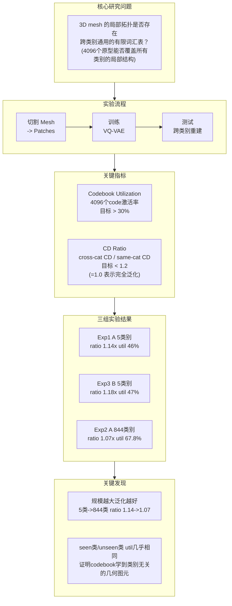
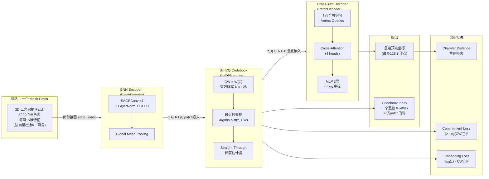
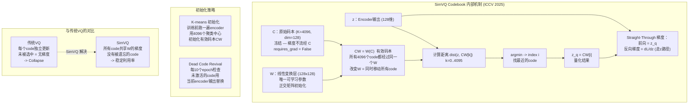

# MeshLex 汇报讲解文档

> 撰写时间：2026-03-10
> 面向对象：明日汇报，讲解任务、架构与原理

---

## 图 1：任务是什么——一句话概括

**MeshLex 要回答的问题是**：3D mesh 的局部结构（拓扑）是否像自然语言一样，存在一套有限的"词汇表"，可以跨越所有物体类别通用？

把一个复杂的 3D 物体（比如一把椅子、一辆车）切成很多小 **Patch**（局部网格片段）。每个 patch 大约有 20 个三角面。直觉上，桌腿的角落、车门的弧面、椅背的平面……这些局部形状在不同物体上反复出现。MeshLex 要把这些重复出现的结构，归纳成 **4096 个原型（codebook entries）**，相当于一本词典，然后验证这本词典是否对没见过的类别（unseen categories）也同样适用。

---

## 图 2：模型架构——三个模块串联

整个模型是一个 VQ-VAE，由三个模块首尾相连：

- **模块 1 PatchEncoder**：GNN 编码器，把一个 patch（小图）压缩成 128 维连续向量 z
- **模块 2 SimVQ Codebook**：离散量化，把 z 映射到词典里最近的"词"，输出 index（整数）和量化向量 z_q
- **模块 3 PatchDecoder**：跨注意力解码器，把 z_q 还原为每个顶点的 xyz 坐标

---

## 图 3：SimVQ 的核心原理——为什么不会 Collapse

这是这套工作最重要的技术贡献点，汇报时需要讲清楚。

**传统 VQ-VAE 的问题（Codebook Collapse）**：普通 VQ 中每个 code 只有在被选中时才能收到梯度更新。冷启动状态下某些 code 从未被选中，就永远无法更新，最终只有少数几个 code 存活。

**SimVQ 的解法**：把 codebook 分拆为冻结的 C 和可学习的线性变换 W，有效码本是 CW = W(C)。改变 W 等于同时移动所有 4096 个 CW，因此即使某个 code 没被选中，也会随着 W 的更新被间接调整。

**形象比喻**：传统 VQ 像 4096 个独立演员，只有上台的才练功；SimVQ 像让所有演员共用一套训练体系（W），台下的人也被动提升。

---

## 评估逻辑——两个关键指标

**指标 1：Codebook Utilization（利用率）**

在评估集上，4096 个 code 里有多少个被至少激活了一次。目标是 > 30%。利用率太低说明 codebook collapse，词典里大部分"词"是废的。

**指标 2：CD Ratio（跨类别 CD 比值）**

$$\text{CD Ratio} = \frac{\text{Cross-category Chamfer Distance}}{\text{Same-category Chamfer Distance}}$$

- **分子**：用 unseen 类别（从未训练过的 50 个类别）的 patch 来重建，算重建误差
- **分母**：用 seen 类别的 patch 来重建，算重建误差
- 比值越接近 1.0，说明词汇表对未见类别的泛化能力越强
- 目标：< 1.2（误差最多比 seen 类别高 20%）

---

## 三组实验结论与 Scaling 发现

| 实验 | 规模 | Stage | CD Ratio | Util (same) | Util (cross) | 结论 |
|------|------|-------|----------|-------------|--------------|------|
| Exp1 | 5 类别 | A（单token KV）| 1.14x | 46.0% | — | ✅ STRONG GO |
| Exp3 | 5 类别 | B（4token KV）| 1.18x | 47.1% | 47.3% | ✅ STRONG GO |
| **Exp2** | **844 类别** | **A** | **1.07x** | **67.8%** | **48.2%** | ✅ **STRONG GO** |

最关键的发现：规模从 5 类扩展到 844 类，CD ratio **下降**（1.14→1.07），utilization **上升**（46%→67.8%）。通常我们担心数据越多越复杂、越难泛化——但实验结果反过来，更多类别的训练让词汇表更丰富、对未见类别的描述反而更准确。

**Exp3 的特殊发现**：same-cat eval util（47.1%）和 cross-cat eval util（47.3%）几乎完全相同，差距仅 0.2%。这意味着 unseen 类别和 seen 类别激活了同样多、同样分布的 codebook entries——词汇表真的是类别无关的。

---

## 汇报推荐顺序

1. **先讲"我们在问什么问题"**：类比 NLP 的词汇表直觉，引出图 1
2. **展示整体架构**：Patch 切割 → Codebook index 的流程，对应图 2
3. **重点讲 SimVQ**：为什么不 collapse，Frozen C + Learnable W，对应图 3（这是最容易被问到的）
4. **展示三组实验的结果表格**：强调 scaling 发现和 cross-cat util 对称性
5. **一句话结尾**：词汇表假设在 844 个类别上得到实验支持，STRONG GO

---

*文档生成时间：2026-03-10*
*数据来源：results/exp1_v2_collapse_fix/, results/exp3_B_5cat/, results/exp2_A_lvis_wide/*
