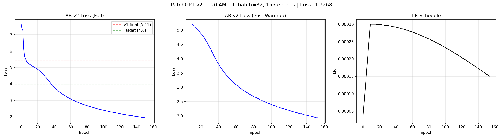

# AR v2 Training Progress — Epoch 154

## Summary
| Metric | Value |
|--------|-------|
| Epochs completed | 155 / 300 |
| Latest loss | 1.9268 |
| Perplexity | 6.9 |
| Target loss | ≤ 4.0 (ACHIEVED at epoch ~40) |
| v1 final loss | 5.41 (perplexity 224) |
| Time per epoch | ~32s |
| Est. remaining | 1.3h |

## Loss Milestones
| Epoch | Loss | Perplexity | Note |
|-------|------|------------|------|
| 0 | 7.6358 | 2071 | Start |
| 10 | 5.2040 | 182 | Warmup end |
| 50 | 3.3834 | 29 | Target 4.0 surpassed |
| 100 | 2.3946 | 11 | |
| 154 | 1.9268 | 6.9 | Latest |

## Training Curves

