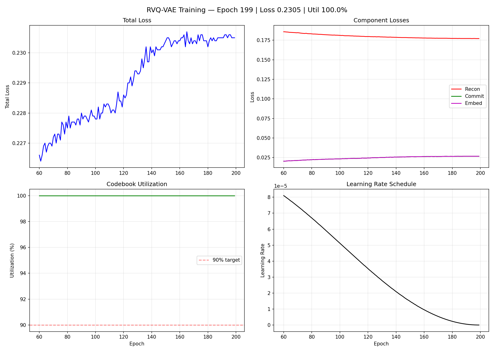
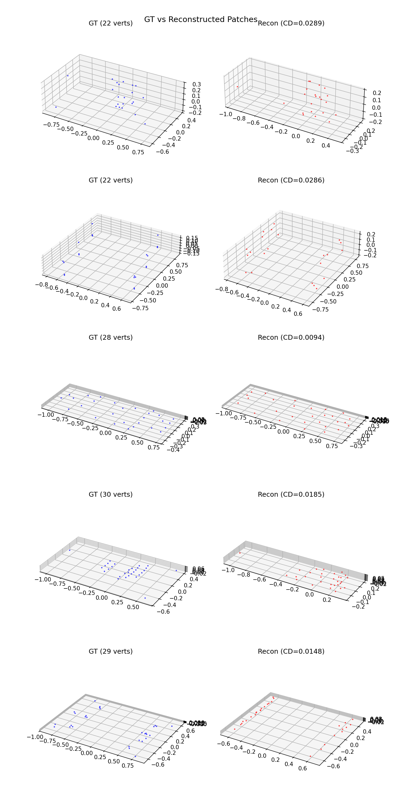

# RVQ-VAE Training Progress — 20260319_0235

## Summary
- Epochs completed: 200
- Latest loss: 0.2305
- Recon loss: 0.1771
- Commit loss: 0.0267
- Embed loss: 0.0267
- Codebook utilization: 100.0%
- Learning rate: 0.00e+00
- Time per epoch: 180.0s

## Training Curves

## Reconstruction Samples

## Epoch History (last 10)
| Epoch | Loss | Recon | Commit | Embed | Util | LR |
|-------|------|-------|--------|-------|------|----|
| 190 | 0.2305 | 0.1772 | 0.0267 | 0.0267 | 100.0% | 5.25e-07 |
| 191 | 0.2305 | 0.1772 | 0.0267 | 0.0267 | 100.0% | 4.15e-07 |
| 192 | 0.2306 | 0.1772 | 0.0267 | 0.0267 | 100.0% | 3.18e-07 |
| 193 | 0.2306 | 0.1772 | 0.0267 | 0.0267 | 100.0% | 2.33e-07 |
| 194 | 0.2305 | 0.1771 | 0.0267 | 0.0267 | 100.0% | 1.62e-07 |
| 195 | 0.2306 | 0.1772 | 0.0267 | 0.0267 | 100.0% | 1.04e-07 |
| 196 | 0.2306 | 0.1772 | 0.0267 | 0.0267 | 100.0% | 5.84e-08 |
| 197 | 0.2305 | 0.1771 | 0.0267 | 0.0267 | 100.0% | 2.60e-08 |
| 198 | 0.2305 | 0.1771 | 0.0267 | 0.0267 | 100.0% | 6.49e-09 |
| 199 | 0.2305 | 0.1771 | 0.0267 | 0.0267 | 100.0% | 0.00e+00 |
