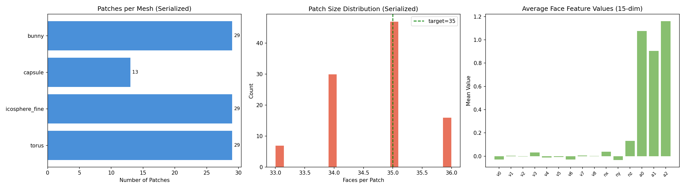
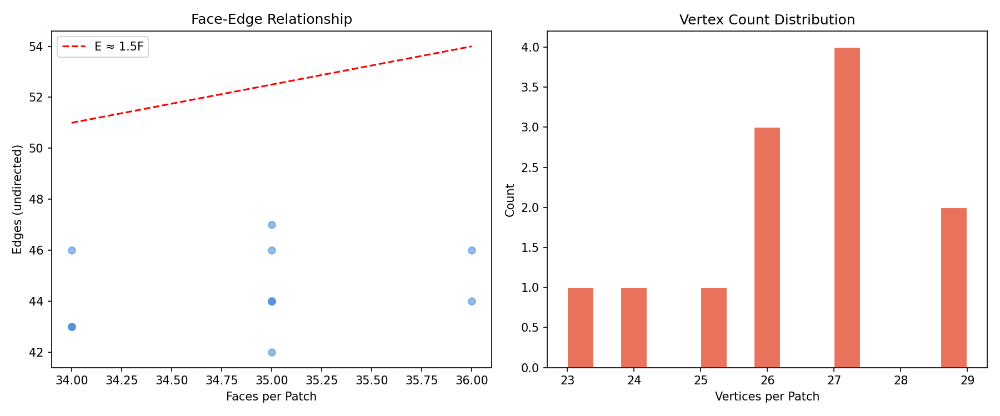
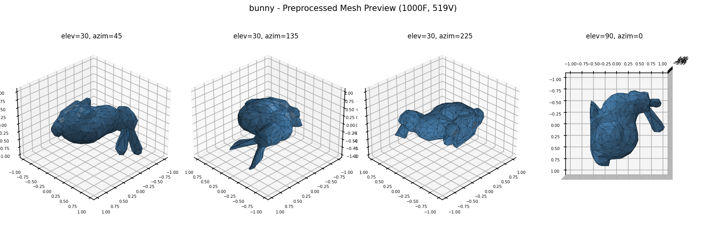
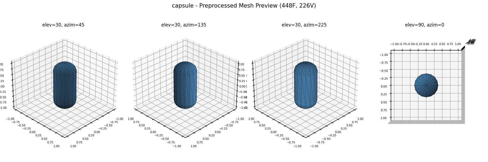
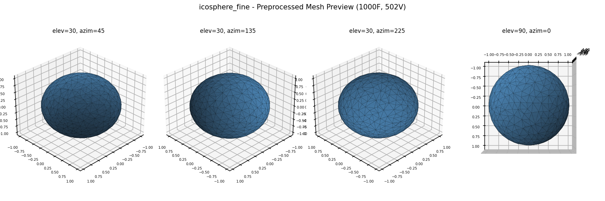
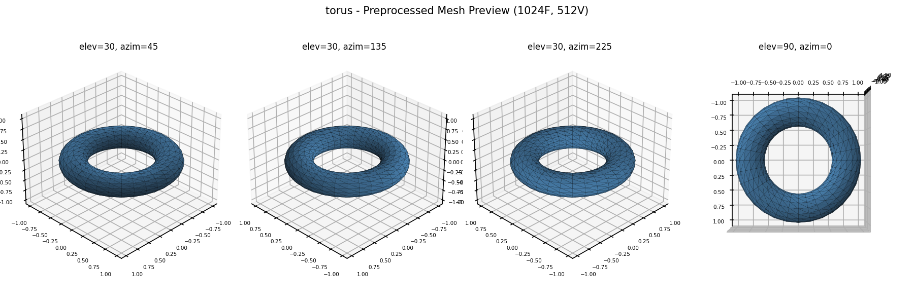

# Task 4 Validation Report

**Date:** 2026-03-07 08:36:31

## Patch Serialization

| Mesh | Patches | Face Range | NPZ Files | Time |
|------|---------|------------|-----------|------|
| bunny | 29 | [33, 35] | 29 | 0.036s |
| capsule | 13 | [34, 35] | 13 | 0.109s |
| icosphere_fine | 29 | [33, 35] | 29 | 0.037s |
| torus | 29 | [34, 36] | 29 | 0.037s |

**Total patches:** 100

## PatchDataset Loading

- All patches load correctly as PyTorch tensors
- face_features: (80, 15) float32 — padded to MAX_FACES
- edge_index: (2, E) int64 — face adjacency graph
- local_vertices: (60, 3) float32 — padded to MAX_VERTICES

## Visualizations

## Mesh Previews

### bunny

### capsule

### icosphere_fine

### torus

## Conclusion

- Patch serialization produces correct .npz files with all required fields
- PatchDataset loads patches and computes 15-dim face features correctly
- Edge index construction matches expected manifold topology (E ≈ 1.5F)
- Feature padding works correctly for batch training