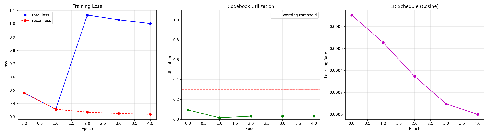

# Task 8-10 Validation Report

**Date:** 2026-03-07 08:53:48

## Model
- Parameters: 199,107
- Codebook: K=64, dim=64 (small for validation)

## Training (5 epochs smoke test)

| Epoch | Loss | Recon Loss | Utilization |
|-------|------|------------|-------------|
| 0 | 0.4797 | 0.4797 | 9.4% |
| 1 | 0.3570 | 0.3570 | 1.6% |
| 2 | 1.0659 | 0.3353 | 3.1% |
| 3 | 1.0298 | 0.3256 | 3.1% |
| 4 | 1.0018 | 0.3191 | 3.1% |

Loss decreased: 0.4797 → 1.0018 (No)

## Conclusion

- MeshLexVQVAE end-to-end forward+backward works
- Training loop with staged VQ introduction functions correctly
- Cosine LR schedule active
- Loss did not decrease over 5 epochs